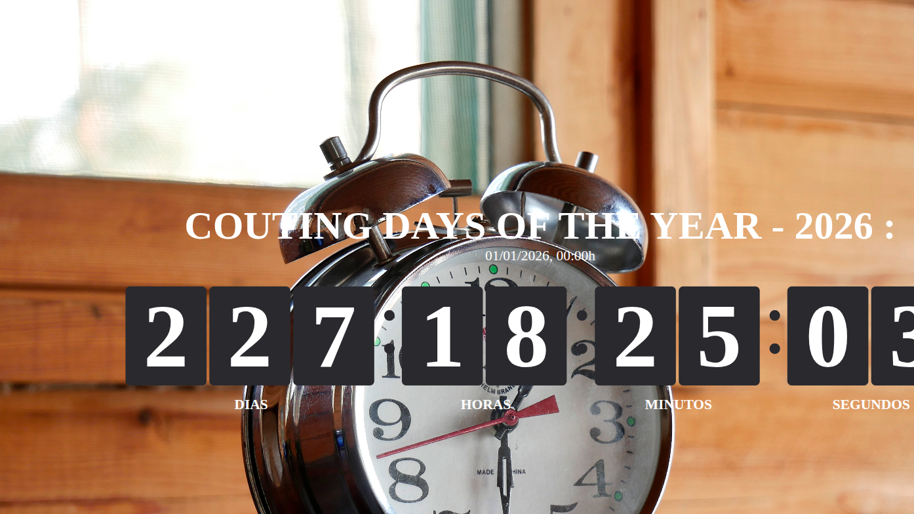

# DSPLAY - Count Up Template

A [React](https://reactjs.org/) [HTML-based template](https://developers.dsplay.tv/docs/html-templates) for the [DSPLAY - Digital Signage](https://dsplay.tv/) platform — shows a full-screen days/hours/minutes/seconds counter, counting up from a starting date (e.g. "Counting days since...").

> Built with [Vite](https://vitejs.dev/), requires Node.js 22.22.2+, 24.15.0+, or 26+ (see `.nvmrc`).

## Supported screen formats

| Landscape |
|-----------|
|  |

> Portrait, square, and banner formats aren't supported yet — the flip-clock/title layout is fixed-width and overflows at other aspect ratios.

## Template variables

| Key              | Type  | Description                                                        |
|-------------------|-------|---------------------------------------------------------------------|
| `bg_color_1`      | color | Background color. Combined with `bg_color_2` (if set) into a gradient. |
| `bg_color_2`      | color | Optional second background color, for a gradient with `bg_color_1`.  |
| `bg_image`        | image | Optional background image, takes precedence over the background color(s). |
| `bg_font_color`   | color | Text color for the title, date, and timer labels.                   |

The counter's title and start date come from the media itself (`media.title`/`media.date`), not from Template Vars — set them when scheduling this template's content in the DSPLAY CMS.

> Remember to also register the variables above as Template Vars (same name and type) when configuring this template in the DSPLAY CMS.

## Local development

```sh
npm install
npm start
```

`public/dsplay-data.js` defines `dsplay_config`/`dsplay_media`/`dsplay_template` mock globals used only when the template isn't running inside the actual DSPLAY app. Edit it to try out different colors/images/dates — the DSPLAY Player App replaces it with real content at runtime.

## Packing (release build)

```sh
npm run zip
```

This builds the template with Vite, which also generates `template-variables.json` + `template-example-data.json` (via [@dsplay/template-manifest](https://www.npmjs.com/package/@dsplay/template-manifest)'s Vite plugin) — the DSPLAY CMS reads these two files to auto-detect this template's variables and seed default preview values. It then generates `template.zip`, ready to be deployed to the [DSPLAY Web Manager](https://manager.dsplay.tv/template/create).

## Test assets

To use test assets (images, videos, etc) during development, put them in the `public/test-assets` folder and reference them in `dsplay-data.js` using their relative path. `public/test-assets` is automatically excluded from the release build.

## Maintaining dependencies

Regular npm dependencies, not vendored files:

```sh
npm outdated
npm update
```

For a version outside the declared range (typically a major bump), apply it deliberately and verify `npm start`, `npm run build`, and `npm test` still work before committing.

### Commit conventions

See [AGENTS.md](AGENTS.md).

## More

To see more about DSPLAY HTML Templates, visit: https://developers.dsplay.tv/docs/html-templates
